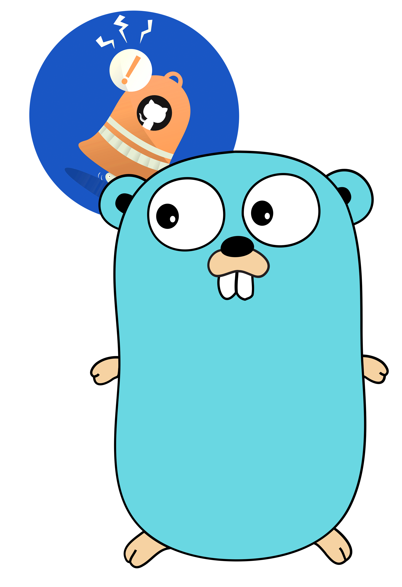
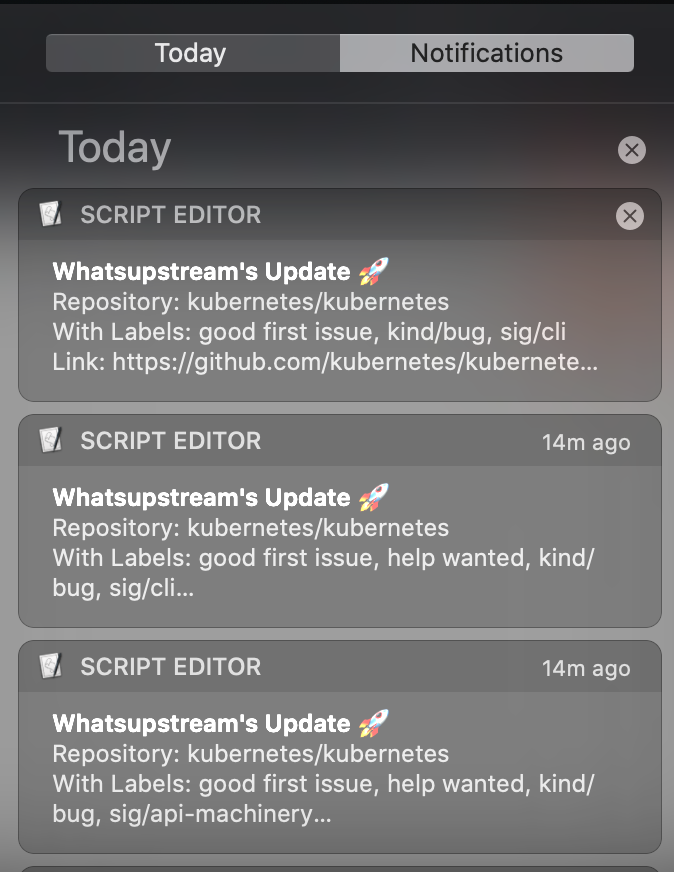

<!-- PROJECT LOGO -->
<br />
<p align="center">
  
  <h3 align="center"> :rocket: Whatsupstream :rocket: </h3>

  <p align="center">
    A tool which will keep you up-to-date with the activity (issues) of your favorite Open Source repositories without any hassle or even opening browser.<br>
    Just tweak it according to your wants and it will notify on your desktop, if any issue meeting your criteria (like certain labels/creator) of any OSS repository got created. :sunglasses:
    <br />
    <br />
    ·
    <a href="https://github.com/yashvardhan-kukreja/whatsupstream/issues/new?assignees=&labels=bug&template=bug_report.md&title=">Report Bug</a>
    ·
    <a href="https://github.com/yashvardhan-kukreja/whatsupstream/issues/new?assignees=&labels=feature&template=feature_request.md&title=">Request Feature</a>
  </p>
</p>


<!-- TABLE OF CONTENTS -->
## Table of Contents

* [About the Project](#about-the-project)
* [Getting Started](#getting-started)
  * [Prerequisites](#prerequisites)
  * [Project Setup](#project-setup)
* [Whatsupstream in action](#whatsupstream-in-action)
* [Contributing](#contributing)
* [License](#license)
* [Acknowledgements](#acknowledgements)

<!-- ABOUT THE PROJECT -->
## About Whatsupstream

Whatsupstream is a tool (CLI actually) which runs as a background process and tracks the activity associated with any Open Source repositories you tell it. (for now, it tracks issues)

Say, you want to be notified as soon as possible whenever an issue with `good first issue` and `sig/node` labels is created in  [Kubernetes](https://github.com/kubernetes/kubernetes)

Just tell Whatsupstream (configure it, it's easy :P) about it and this tool will simply run behind the scenes and raise a desktop notification on your computer as soon it sees such kind of issue.

Benefit? 

You can pick that issue up instantly before anyone picks it up :P, work on it and be a proud OSS contributor :D

PS: you can configure it for countless repositories as per your liking.

<!-- GETTING STARTED -->
## Getting Started

Here are instructions to setup and use whatsupstream.

### Prerequisites

Just have `make` installed in your computer, rest all will be handled automatically for you.

Behind the scenes, this project entirely runs on GoLang but if you don't have it, no worries, `make` will set it up for you :)

### Project Setup

1. For getting the latest stable release
```sh
curl -L https://github.com/yashvardhan-kukreja/whatsupstream/archive/v0.1.tar.gz | tar xvz
cd whatsupstream-* && sudo make install
```

2. Setup your whatsupstream configuration in YAML by referring to [Whatsupstream Configuration Guide](./docs/configuration-guide.md) and save it in `$HOME/.whatsupstream/config.yaml` (preferable) or any other place.
4. Run it as a background process :rocket:

    * If your whatsupstream config is at `$HOME/.whatsupstream/config.yaml`
    ```sh
    whatsupstream notify --background
    ```
    * If your whatsupstream config is at some other place, say, `/path/to/other/place/whatsupstream.yaml`
    ```sh
    whatsupstream notify --background --config /path/to/other/place/whatsupstream.yaml
    ```
OR

5. Just run it as a foreground process with:
```sh
whatsupstream notify --config /path/to/config.yaml
```
Whatsupstream runs as a background process. So, to stop all the instances of whatsupstream, just run:
```sh
whatsupstream stop
```

<!-- USAGE EXAMPLES -->
## Whatsupstream in action

<p align="center" style="margin:20px 20px 20px 20px;"></p>

<!-- CONTRIBUTING -->
## Contributing

Refer to the [Developer's Guide](./docs/developer-guide.md) for a detailed explanation of developing over, testing and contributing to whatsupstream.

<!-- LICENSE -->
## License

Distributed under the Apache License Version 2.0. See [LICENSE](https://github.com/yashvardhan-kukreja/whatsupstream/blob/master/LICENSE) for more information.

<!-- ACKNOWLEDGEMENTS -->
## Acknowledgements
  * [Gopher in the icon](https://cdn.freebiesupply.com/logos/large/2x/gopher-logo-png-transparent.png)
  * [Bell in the icon](https://www.freepik.com/vectors/background)
  * [GitHub logo in the icon](https://github.githubassets.com/images/modules/logos_page/GitHub-Mark.png)
